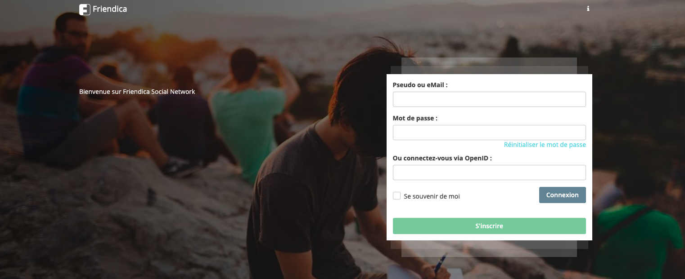

# Friendica CI/CD pipeline

Deploy Friendica server with CI/CD on Elestio

 
 

# Once deployed ...

You have to register with this email address: [EMAIL] to create admin access in this URL:

    URL: https://[CI_CD_DOMAIN]

You will then receive an email confirmation along with your password.

# Custom domain instructions (IMPORTANT)

By default, we set up a CNAME on elestio.app domain, but probably you will want to have your own domain.

***Step 1:*** Add your domain in the Elestio dashboard as explained here:

    https://docs.elest.io/books/security/page/custom-domain-and-automated-encryption-ssltls

***Step 2:*** Modify the environment variables and configuration settings to incorporate your personalized domain. 

Open the Elestio dashboard -> Navigate to Service > Tools > Launch VS Code, then proceed to edit the domain in the ENV and Config files. 

Within the ENV File, substitute the existing values of `FRIENDICA_URL` with your specified domain. Additionally, within the `friendica/config/local.config.php` file, replace instances of the `elestio.app` domain with your chosen custom domain.

***Step 3:*** Open Terminal and run the command:

      docker-compose down;
      docker-compose up -d
